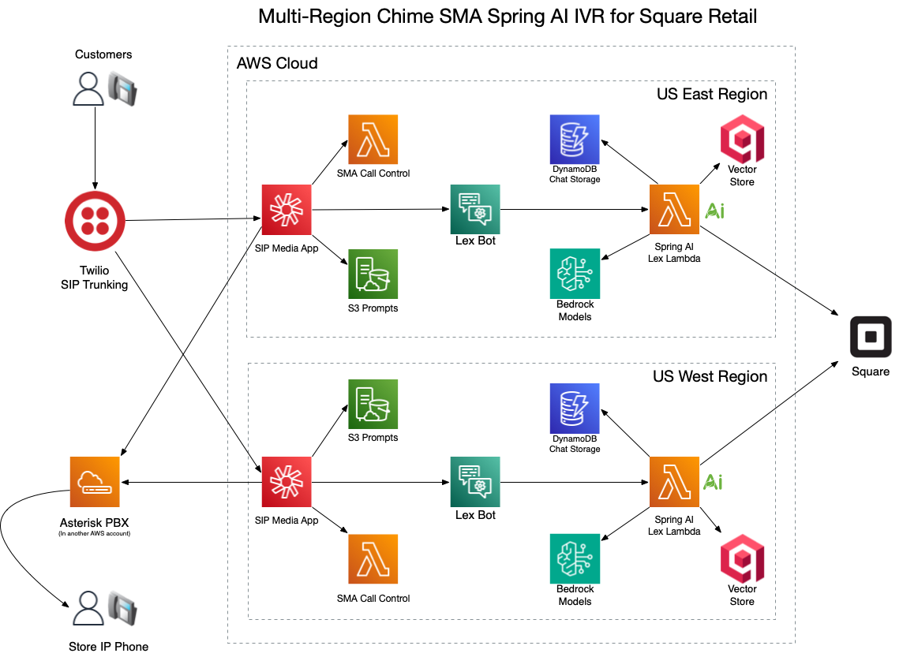

# Amazon Chime SMA Spring AI IVR for Square Retail

## Background

This project is a [SIP Media Application](https://docs.aws.amazon.com/chime-sdk/latest/ag/use-sip-apps.html) and makes use of the 
[Java Chime SMA Flow Library](https://github.com/docwho2/java-chime-voicesdk-sma) to deliver a [Spring AI](https://docs.spring.io/spring-ai/reference/) voice bot IVR application. The IVR application is integrated with the [Square API](https://developer.squareup.com/us/en) to allow callers to ask questions about products 
and business hours, transfer to employee cell phones, etc.

## Testing Links

[Nova 2 Lite Smoke Tests](https://docwho2.github.io/java-squareup-spring-ai-ivr/us.amazon.nova-2-lite-v1_0/SmokeTests).

Full model regression testing coming soon...

# 🚀 Why This Project Is Enterprise-Grade (Not a Demo)

This application is the result of **years of real-world production use**, customer feedback, multi-region deployments, and extensive testing. It is **not a prototype** or reference sample. It is a **carrier-grade AI voice and messaging platform** engineered end-to-end for reliability, performance, and telephony-class expectations.

Unlike most AI “phone bot” demos, this system was built to run **24/7 at production scale**, across multiple AWS regions, with full call control, strict latency requirements, and enterprise operational concerns built in from day one.

---

## 🧱 Built on a Modern, Enterprise Java Stack

Every component is **100% Java**, type-safe, and production-quality:

- **Java 25**
- **Spring Boot 4.0.0**
- **Spring Cloud 5.0.0**
- **Spring AI 2.0.0 (validated on 2.0.0-M1)**
- **AWS Bedrock (Nova, Claude)** and **OpenAI GPT models**
- **AWS-native services:** Chime, Lex, DynamoDB, SES, SNS, Pinpoint, Polly, Lambda SnapStart

This is not a loose collection of scripts — it is a **cohesive, enterprise software system** with a well-defined architecture and production lifecycle.

---

## 🌐 Multi-Region, Carrier-Grade, Fault-Tolerant Architecture

This application is designed with the same principles found in telecommunications infrastructure:

- **Active-active AWS region support**
- **Chime SIP numbers and Twilio SIP trunks** mapped to **multi-region outcomes**
- Fully serverless and able to scale from **0 to any CPS that Chime supports**
- **No single region dependency**
- **DynamoDB Global Tables** for cross-region conversational continuity
- Multi-region **Lambda SnapStart** for minimal cold start impact

High availability is not bolted on — it is the **core design philosophy**.

---

## 🛰 Full CI/CD Pipeline with CDK, SAM & GitHub Actions

Provisioning a multi-region AI telephony platform requires deep infrastructure automation:

- **AWS CDK** provisions all region-dependent infrastructure  
  (including Chime SIP Media Applications, which are *not* available in CloudFormation)
- **Custom CDK resources** build and configure Chime SMA + phone numbers  
- **Twilio constructs** created and wired automatically
- **AWS SAM** provisions Lex, Lambda, permissions, IAM roles for each region
- GitHub Workflows implement a **complete CI/CD pipeline**

Even the infrastructure layer is production-grade.

---

## 🔊 Advanced Chime SMA Telephony Framework (Custom Library)

This system includes a **bespoke Chime SMA Java library** representing hundreds of hours of development:

- Multi-step Chime flows (play prompt A → play prompt B → engage bot) in a **single Lambda turn**  
  → dramatically lower latency  
  → smoother audio experience  
- Typical execution time: **4–10ms per SMA operation**
- Automatic chaining and orchestration of SMA actions  
- Automatic prompt creation using **Polly → S3** pipeline  
  → static prompts for lower latency and lower cost vs live TTS  

This is **beyond** what AWS provides natively.

---

## ⚡ Lambda SnapStart + CRT Optimizations for Real-Time Voice Latency

Voice interactions cannot tolerate slow responses. The entire platform is optimized for **real-time performance**:

- Every Lambda function is **SnapStart-enabled** to eliminate cold starts
- AWS CRT client is used for **all AWS service SDKs** (Dynamo, SNS, SES, Pinpoint, Bedrock…)  
  → reduced latency  
  → reduced connection overhead  
- Java virtual threads used where applicable for efficient concurrency

This stack is engineered specifically for **telephony latency budgets**.

---

## 🤖 Spring AI: Unified Intelligence Layer (Model-Agnostic)

Spring AI gives this platform the flexibility to plug in:

- **AWS Bedrock models** (Nova 2, Claude, etc.)
- **OpenAI GPT models**
- Future providers without architectural changes

The LLM is not the system — it is **one replaceable component inside a much larger, orchestrated platform**.

---

## 📚 DynamoDB Chat Memory Optimized to the Highest Degree

The custom [DynamoDbChatMemoryRepository](./dynamo_chat_memory_readme.md) achieves:

- **1 read + 1 write per turn** (despite Spring AI calling memory APIs 4–6 times internally)
- Intelligent **per-invocation caching** to avoid redundant I/O
- Append-only tail writes, no rewrites  
- TTL-based cleanup (zero operational overhead)
- Multi-region DynamoDB Global Table compatibility

This is **the most optimized ChatMemoryRepository available for AWS**.

---

## 📞 Full AI Call Control

This system doesn’t just “respond” — it **controls the call**.

The LLM, through Spring AI Tools, can:

- Hang up the call  
- Transfer the call  
- Send SMS messages  
- Provide URLs, directions, booking links  
- Validate product availability  
- Check store hours  
- Switch languages mid-call  
- Escalate to a human  

This transforms the system from “AI answering machine” to a **fully capable AI call agent**.

---

## 🌍 Full Multi-Channel Intelligence

The system handles:

- **Chime SMA voice calls**
- **SMS (Twilio + AWS Pinpoint)**
- **Facebook Messenger** with automated **handover to page inbox**
- All channels share the **same**:
  - Spring AI engine  
  - Tooling layer  
  - Memory system  
  - Prompting strategy  

Channel-specific constraints (e.g., transfer tools not applicable to SMS) are automatically enforced.

---

## 🗣 Amazon Lex as the Multi-Language Voice Gateway

Lex plays a pivotal role:

- Provides **multi-language ASR/TTS** front-end for Chime calls  
- Normalizes text input before AI processing  
- Enables voice testing without placing a phone call  
- Allows channel-unified request envelopes for Spring AI
- Routes locale changes back to Chime for correct bot engagement

This delivers a **consistent, multilingual voice experience** across all channels.

---

## 🏁 Summary: A Carrier-Grade IVR Framework Powered by Spring AI

This system represents:

- **1,000+ hours of engineering**
- Multi-region architecture from day one
- A fully orchestrated telephony + AI platform
- Production reliability baked into every component
- Real customers using it daily

This is not a demo.  
This is **a next-generation enterprise IVR and multi-channel assistant framework**, backed by the model of your choice and deployed across AWS at carrier scale.


## High Level Goals

The goal is to introduce a "Store Virtual Assistant" powered by [Spring AI](https://docs.spring.io/spring-ai/reference/) that can not only answer store-specific queries but also address any general questions the caller might have.
- Utilize [Spring AI Tooling](https://docs.spring.io/spring-ai/reference/api/tools.html) to facilitate Square API calls, enabling access to inventory, employee details, and store hours.
  - Further leverage tool calls so that the model can determine when a call should be transferred or concluded.
- Employ strategic prompting to prime the model with pertinent store information and to guide interactions with callers.
- Ensure a robust and dependable solution that is deployed across multiple regions within AWS and is entirely cloud-based.
- CI/CD [GitHub Workflow](https://docs.github.com/en/actions/using-workflows/about-workflows) that deploys/updates two regions in parallel.

**Features:**
- Callers are consistently greeted and informed about the store's operational status (open or closed).
- Store hours are ascertained in real-time via a Square API call.
- Product category and individual item searches are also driven by Square API calls.
  - Callers can inquire about product categories or specific items in stock.
- Engaging with store employees or the primary store line.
  - Callers can request to connect with specific employees, with the information sourced from a Square API call (Team Member list).
  - If the caller simply wishes to speak to a representative, the model is preloaded with a default number to redirect the call.
    - During transfers to the main line, this process is optimized to use SIP directly connecting to the store's [Asterisk PBX](https://www.asterisk.org).
- Directions to the store can be requested and Google directions URL can be sent to the callers mobile device if requested.
  - When interacting with Text the link is just returned, when using voice, the link is sent to the caller.
- Messages can be sent to via Email to any of the employees.
  - The Model can compose some interesting emails, quite entertaining.
  - The calling number is included in the subject of the email to lend context.
- Language Support
  - When interacting via Text channels (Facebook and SMS via Twilio) any language the Model knows about (over 100) is supported.
    - The Model detects your language and responds in that language.
  - When interacting via Voice any [language Lex supports](https://docs.aws.amazon.com/lexv2/latest/dg/how-languages.html) is possible.
    - This project is configured with English, Spanish, German, Dutch, Finnish, French (Canadian), Norwegian, Polish, and Swedish.
      - These are the more common languages spoken in northern Minnesota (Strong Nordic population).
    - The Model tries to detect (or you can ask of course) if you want to speak in another language.
    - Model tooling is used to trigger a language context switch and then the call is moved from one Bot Locale to another at the Chime level.
  - The Model is instructed to translate request parameters into English so searching items in the Store works in any language.
    - Do you have gummy bears?  in Spanish is "¿Tienes ositos de goma?".
    - Sí, tenemos ositos de goma. Ofrecemos "Big Yummy Gummy Bear - 12 Ct.", "Snack Pack O'Gummy Bears Milk Chocolate", y "Triple-Decker Candy Sour Gummy Bears".


## Demonstration Videos

[Video Playlist of all Demos](https://www.youtube.com/playlist?list=PLd4zA87i_34RG3u4pmvKE9Ms-Qi-7eW9H)

[](https://youtu.be/2DNpgT-o_XA)


## High Level Components



## Call Flow Details

### SMA Controller

The [ChimeSMA](ChimeSMA/src/main/java/cloud/cleo/chimesma/squareup/ChimeSMA.java) controller controls the call at a high level.  Callers are greeted and told whether the store is open or closed.

```Java
protected Action getInitialAction() {

        // Play open or closed prompt based on Square Hours  
        final var openClosed = PlayAudioAction.builder()
                .withKeyF(f -> switch (squareHours.getStatus()) {
            case OPEN ->
                "open.wav";
            case EXTENDED_CLOSED ->
                "extended_closed.wav";
            case CLOSED ->
                "closed.wav";
        }) // This is always in english
                .withNextAction(MAIN_MENU)
                .withErrorAction(MAIN_MENU)
                .build();

        // Start with a welcome message
        final var welcome = PlayAudioAction.builder()
                .withKey("welcome.wav") // This is always in english
                .withNextAction(openClosed)
                .withErrorAction(openClosed)
                .build();

        return welcome;
    }
```

Control is then handed off to a Lex Bot which is backed by a LLM to handle the interaction until a terminating event happens.

```Java
final var lexBotEN = StartBotConversationAction.builder()
                .withDescription("LLM English")
                .withLocale(english)
                .withContent("You can ask about our products, hours, location, or speak to one of our team members. Tell us how we can help today?")
                .build();
```

If the Model determines the call needs to be transferred or ended, that action is returned and the SMA Controller transfers or ends the call.

```Java
Function<StartBotConversationAction, Action> botNextAction = (a) -> {
    final var attrs = a.getActionData().getIntentResult().getSessionState().getSessionAttributes();
    final var botResponse = attrs.get("botResponse");  // When transferring or hanging up, play back Model's last response
    final var action = attrs.get("action");  // We don't need or want real intents, so the action when exiting the Bot will be set
    return switch (action) {
        case "transfer" -> {
            final var phone = attrs.get("transferNumber");
            final var transfer = CallAndBridgeAction.builder()
                .withDescription("Send Call to Team Member")
                .withRingbackToneKey("ringing.wav")
                .withCallTimeoutSeconds(60) // Store has 40 seconds before VM, and default is 30, so push to 60 to be safe
                .withUri(phone)
               .build();
            if (phone.equals(MAIN_NUMBER) && !VC_ARN.equalsIgnoreCase("PSTN")) {
                // We are transferring to main number, so use SIP by sending call to Voice Connector
                transfer.setArn(VC_ARN);
                transfer.setDescription("Send Call to Main Number via SIP");
            }
            yield SpeakAction.builder()
                .withDescription("Indicate transfer in progress with Bot response")
                .withTextF(tf -> botResponse)
                .withNextAction(transfer)
                .build();
            }
        case "quit" ->
            SpeakAction.builder()
                .withDescription("Saying Good Bye")
                .withTextF(tf -> botResponse)
                .withNextAction(hangup)
                .build();
        default ->
            SpeakAction.builder()
                .withText("A system error has occured, please call back and try again")
                .withNextAction(hangup)
                .build();
    }; 
};
```


## Chime SDK Phone Number

Once you have deployed the project either via Workflow, everything is all SIP.  At this stage you could integrate a PBX (like Asterisk) and call into the application via the Voice Connector that was providioned, however the easiest way to test is to provision a phone number in the AWS Console, then add the number to variable for CDK to wire up for you.

After provisioning a [phone number in Chime](https://docs.aws.amazon.com/chime-sdk/latest/ag/provision-phone.html), 

[Set repository variable](https://docs.github.com/en/actions/learn-github-actions/variables#creating-configuration-variables-for-a-repository)  **CHIME_PHONE_NUMBER** to the full E164 phone number you just provisioned.  The CDK stack will pick this up on the next workflow run and wire into the application.

## Twilio Provisioning and Setup

[Twilio](https://www.twilio.com/) is like the swiss army knife of communications and allows you greater flexibility than provisioning a PSTN number in AWS Chime Voice SDK.

Pros:
- Larger Phone Number Pool
  - International numbers (UK, Germany, etc.)
  - Chime only provides numbers in the US.
- Flexibility in terms of what you can do with incoming voice calls.
  - Forward the number anywhere at any time.
  - Use local cloud scripts in Twilio to do just about anything.
  - Send to your SIP PBX.
- SMS Support.
  - Forward or respond to SMS in any way you want.
  - You can [connect SMS to the Lex Bot](https://docs.aws.amazon.com/lex/latest/dg/twilio-bot-association.html) deployed in this solution to not only have GPT talk to customers, but also provide the same over SMS.
  - Chime PSTN numbers assigned to SMA's do not support SMS in any way.
- Load Balancing across AWS Regions.
  - Chime numbers point to one region and only failover to the other region if the call can't be sent to the higher priority region.
  - You can equally load balance calls to AWS regions.
    - Futher if both regions didn't respond for some reason you can send the call to another SIP Destination (PBX, or some other destination)
    - You can also use a [SIP Trunk Disaster Recovery URL](https://www.twilio.com/docs/sip-trunking#disaster-recovery) as a failsafe if all of Chime Voice becomes unreachable.
    - In fact you could deploy to as many supported regions as you want, configure balancing equally over us-east-1 and us-west-2, and then a lower priority to ca-central-1 for example.
- Twilio uses AWS itself and and it's [US Edge locations](https://www.twilio.com/docs/global-infrastructure/edge-locations) are positioned inside AWS regions.
  - Low latency and the signaling never really goes over the Internet.

Cons:
- Introduces more complexity dealing with the integration, Chime Numbers just require a SIP Rule pointing to SMA's and done (no Voice Connector necessary).
- Each Twilio number requires a distinct SIP trunk paired to Voice Connectors in Chime Voice SDK.
  - You are limited to 3 Voice Connectors per region in your AWS account by default.

### Twilio Integration Details

The main issue with integration is the fact that say you have Twilio number +1-800-555-5555 and point it at the Chime Voice Connectors.
- Chime recieves the SIP invite and sees that number +1-800-555-5555 is not known and rejects the call because that number does not exist in Chime.
- You can however use [SIP Header Manipulation](https://www.twilio.com/docs/sip-trunking/sip-header-manipulation) to change the _To_ header to +1-703-555-0122.
  - +1-703-555-0122 is special Chime number that the Voice Connector will answer and in conjuction with a _Request URI hostname_ SIP Rule pointing to a SMA will route the call properly into the application.
  - Unfortunately Twilio does not yet provide an API to create these or assign them to a SIP trunk, thus some manual intervention is required for deployment.
    - You only need to create the Header Manipulation Once which can then be used on any SIP trunk moving forward.
    - When you initially deploy and if you destroy and then re-deploy, then you need to go to the Twilio console and apply the header manipulation to the SIP Trunk.

Creating a SIP Header Manipulation in the Twilio Console:
- In the Twilio Console _Develop_ section choose _Elastic SIP Trunking_ --> _SIP Header Manipulations_ [Link](https://console.twilio.com/us1/develop/sip-trunking/settings/header-manipulation?frameUrl=%2Fconsole%2Fsip-trunking%2Fsettings%2Fheader-manipulation%3Fx-target-region%3Dus1).
- Click on _Create a Policy_ in the upper right.
- Enter a name for the policy (like "Chime7035550122").
- Click _Create_.
- Click _Add request rule_.
- Enter a name for the rule (like "To7035550122").
- In the _Actions_ Block enter:
  - SIP header field -> Select _To number_
  - Action -> _Replace with_
  - Value -> _+17035550122_
- Click _Add rule_.
- Click _Save Policy_ at the bottom of Screen.
- You can now apply this to SIP Trunks (that you create or provisioned via CLI or Work Flow).

(more to come here on provisioning)


### Forking repository and utlizing the GitHub Workflow

The [GitHub Workflow](.github/workflows/deploy.yml) included in the repository can be used to a create a full CI/CD pipeline as changes are comitted to the main branch.

To allow the workflow to operate on your AWS environment, you can use several methods, but in this case we are using the recommended [OIDC method](https://github.com/aws-actions/configure-aws-credentials#OIDC) that requires some setup inside your account.  The workflow uses this to setup Credentials:

```yaml
- name: Setup AWS Credentials
      id: aws-creds
      uses: aws-actions/configure-aws-credentials@v4
      with:
        aws-region: ${{ matrix.region }}
        # The full role ARN if you are using OIDC
        # https://github.com/aws-actions/configure-aws-credentials#oidc
        role-to-assume: ${{ secrets.AWS_ROLE_TO_ASSUME }}
        # Set up the below secrets if you are not using OIDC and want to use regular keys (best practice is to use just role above with OIDC provider)
        aws-access-key-id: ${{ secrets.AWS_ACCESS_KEY_ID }}
        aws-secret-access-key: ${{ secrets.AWS_SECRET_ACCESS_KEY }}
        mask-aws-account-id: true
```

You will need to [create secrets](https://docs.github.com/en/actions/security-guides/using-secrets-in-github-actions#creating-secrets-for-a-repository) to use OIDC or Keys.  Set the role or Keys, but not both:

If you are using the [OIDC method](https://github.com/aws-actions/configure-aws-credentials#OIDC)
- Create a Secret named **AWS_ROLE_TO_ASSUME** and set it to the full ARN of the role
  - It should look something like "arn:aws:iam::123456789:role/github-oidc-provider-Role-nqvduv7P15BZ"

If you are going to use [Access Key and Secret](https://repost.aws/knowledge-center/create-access-key)
- Create a Secret named **AWS_ACCESS_KEY_ID** and set to the Access Key ID
- Create a Secret named **AWS_SECRET_ACCESS_KEY** and set to the Secret Access Key

The workflow has sensible defaults (see below snippet from the workflow), but you will need to set up variables and secrets:

```yaml
env:
  # Create secrets in the repository and they will be pushed to Parameter store, these are required
  # If you don't set an API key for square, you can still use ChatGPT by itself
  SQUARE_API_KEY: ${{ secrets.SQUARE_API_KEY || 'DISABLED' }}
  OPENAI_API_KEY: ${{ secrets.OPENAI_API_KEY || 'NEED_TO_SET_THIS' }}  
    
  
  # Create repository variables to override any/all of the below from the defaults
  #
  CDK_STACK_NAME: ${{ vars.CDK_STACK_NAME || 'chatgpt-square-ivr-cdk' }}
  STACK_NAME: ${{ vars.STACK_NAME || 'chatgpt-square-ivr' }}
  
  # The E164 Number to be used when transferring to main number
  TRANSFER_NUMBER: ${{ vars.TRANSFER_NUMBER || '+18004444444' }}
  
  # Set to PRODUCTION if you have a real Sqaure Buisness or Leave it as SANDBOX if you just have a dev account
  SQUARE_ENVIRONMENT: ${{ vars.SQUARE_ENVIRONMENT || 'SANDBOX' }}
  # You can have many locations in Square, need to set to the location you want to query inventory or employees against (required for functions to work)
  SQUARE_LOCATION_ID: ${{ vars.SQUARE_LOCATION_ID || 'DISABLED' }}
  
  # https://platform.openai.com/docs/models/overview (requres model with function calling)
  OPENAI_MODEL: ${{ vars.OPENAI_MODEL || 'gpt-3.5-turbo-1106' }}
  
  # Define in repo variable if you want want to route main number calls via SIP via the Voice Connector
  PBX_HOSTNAME:  ${{ vars.PBX_HOSTNAME || '' }}
  
  # Polly voices to use for English and Spanish https://docs.aws.amazon.com/polly/latest/dg/ntts-voices-main.html
  VOICE_ID_EN: ${{ vars.VOICE_ID_EN  || 'Joanna' }}
  VOICE_ID_ES: ${{ vars.VOICE_ID_ES  || 'Lupe' }}
```

Example [Secrets](https://docs.github.com/en/actions/security-guides/using-secrets-in-github-actions#creating-secrets-for-a-repository) :

OIDC Method:


Access Keys:


Example [Variables](https://docs.github.com/en/actions/learn-github-actions/variables#creating-configuration-variables-for-a-repository) :


The general steps are:
* [Fork the repository](https://docs.github.com/en/get-started/quickstart/fork-a-repo)
* [Setup required Secrets](https://docs.github.com/en/actions/security-guides/using-secrets-in-github-actions#creating-secrets-for-a-repository).
  - Setup either OIDC or Access Keys as described above.
  - Create a Secret named **OPENAI_API_KEY** and set to your API key otherwise ChatGPT will not function.
  - Create a Secret named **SQUARE_API_KEY** if are going to be using Square functionaliy, if don't set this, then square functionality will be disabled.
* Optionaly [set any variables](https://docs.github.com/en/actions/learn-github-actions/variables#creating-configuration-variables-for-a-repository) from the defaults like **OPENAI_MODEL** for example.
  - If you are using square then you must also create a variable named **SQUARE_LOCATION_ID** and set to the Location ID you want the API to query.
  - If you are using a production Square API Key, then also create a variable named **SQUARE_ENVIRONMENT** and set it to **PRODUCTION** as the default is **SANDBOX**.
  - Create variables for anything else you want to tweak like stack names, ChatGPT model, etc.

Then start committing changes and watch the magic happen.  CDK deploys regions in parallel and then a matrix job deploys each region in parallel for faster deployments:


## Sample Asterisk Config

Connecting your PBX to the Chime Voice Connectors to send and receive calls.  You would take the Chime Voice Connector hostnames from the output of stacks after deployment.  Obviously if you tear down the stacks and redeploy, the Voice Connector names will change, so you need to go back to Asterisk and update the names.

_pjsip_wizzard.conf_ examples: 

```properties
[aws-chime-virginia]
type=wizard
transport=transport-udp
remote_hosts=fdtthyhzkjkmvgvgvgykxx.voiceconnector.chime.aws
endpoint/context=incoming-twilio
endpoint/disallow=all
endpoint/allow=ulaw
endpoint/direct_media=no
endpoint/dtmf_mode=auto
endpoint/rtp_symmetric=yes

[aws-chime-oregon]
type=wizard
transport=transport-udp
remote_hosts=cyl0xlnxwrojzkca0pz0d2.voiceconnector.chime.aws
endpoint/context=incoming-twilio
endpoint/disallow=all
endpoint/allow=ulaw
endpoint/direct_media=no
endpoint/dtmf_mode=auto
endpoint/rtp_symmetric=yes
```

_extensions.conf_ excerpt:

```properties
[incoming-twilio]

exten => _+1320495242X,1,NoOp(Call for Copper Fox DID ${EXTEN})
        same => n,Goto(copperfox,${EXTEN:1},1)


[copperfox]
include => outbound-tc-local
include => outbound-longdistance

; Calls will come from Chime Voice Connector (or Twilio)
exten => 13204952424,1,NoOp(Call to Copper Fox Main Line)
	same => n,GoSub(known-callers,start,1)
        same => n,Dial(SCCP/13204952424,40)
        same => n,VoiceMail(${EXTEN})
        same => n,Hangup()

; Call SMA in East and failover to West if down
exten => 290,1,NoOP(Call to AWS Chime)
        same => n,Dial(PJSIP/+17035550122@aws-chime-virginia)
        same => n,Playback(sorry-youre-having-problems)
        same => n,Dial(PJSIP/+17035550122@aws-chime-oregon)

; Call SMA in the East region only
exten => 291,1,NoOP(Call to AWS Chime)
        same => n,Dial(PJSIP/+17035550122@aws-chime-virginia)

; Call SMA in the West region only
exten => 292,1,NoOP(Call to AWS Chime Oregon)
        same => n,Dial(PJSIP/+17035550122@aws-chime-oregon)

```

I've alo observed that Chime endpoints can change over time, usually there are 12, but once Asterisk locks them in it doesn't seem to update them over time.  Asterisk will refuse the call if a new endpoint is added/swapped at some point, so the brute force solution is to just relaod Asterisk every morning.

```
[root@Asterisk asterisk]# crontab -l
0 6 * * * /sbin/asterisk -x "core restart when convenient"

[root@Asterisk asterisk]# dig fdtthyhzkjkmvgvgvgykxx.voiceconnector.chime.aws

; <<>> DiG 9.11.4-P2-RedHat-9.11.4-26.P2.amzn2.13.5 <<>> fdtthyhzkjkmvgvgvgykxx.voiceconnector.chime.aws
;; QUESTION SECTION:
;fdtthyhzkjkmvgvgvgykxx.voiceconnector.chime.aws. IN A

;; ANSWER SECTION:
fdtthyhzkjkmvgvgvgykxx.voiceconnector.chime.aws. 60 IN A 3.80.16.114
fdtthyhzkjkmvgvgvgykxx.voiceconnector.chime.aws. 60 IN A 3.80.16.0
fdtthyhzkjkmvgvgvgykxx.voiceconnector.chime.aws. 60 IN A 3.80.16.101
fdtthyhzkjkmvgvgvgykxx.voiceconnector.chime.aws. 60 IN A 3.80.16.108
fdtthyhzkjkmvgvgvgykxx.voiceconnector.chime.aws. 60 IN A 3.80.16.103
fdtthyhzkjkmvgvgvgykxx.voiceconnector.chime.aws. 60 IN A 3.80.16.115
fdtthyhzkjkmvgvgvgykxx.voiceconnector.chime.aws. 60 IN A 3.80.16.102
fdtthyhzkjkmvgvgvgykxx.voiceconnector.chime.aws. 60 IN A 3.80.16.100
fdtthyhzkjkmvgvgvgykxx.voiceconnector.chime.aws. 60 IN A 3.80.16.107
fdtthyhzkjkmvgvgvgykxx.voiceconnector.chime.aws. 60 IN A 3.80.16.1
fdtthyhzkjkmvgvgvgykxx.voiceconnector.chime.aws. 60 IN A 3.80.16.116
fdtthyhzkjkmvgvgvgykxx.voiceconnector.chime.aws. 60 IN A 3.80.16.106
```
